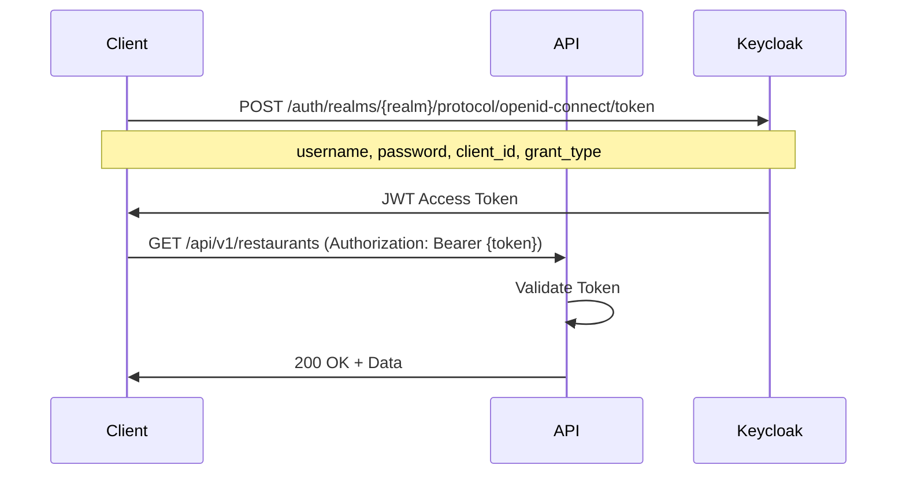

# API Design

## Overview

The Food Delivery Platform exposes a RESTful API that follows industry best practices and REST principles. The API supports all operations required for the platform, from user management to order processing.

## API Design Principles

1. **RESTful**: Resource-based URLs, HTTP methods for operations
2. **Stateless**: Each request contains all necessary information
3. **JSON**: Standard request/response format
4. **Versioning**: API versioning for backward compatibility
5. **Security**: OAuth2/JWT authentication for all protected endpoints
6. **Documentation**: OpenAPI/Swagger for API documentation
7. **Pagination**: Support for large result sets
8. **Filtering**: Query parameters for filtering and sorting
9. **Error Handling**: Consistent error response format

## Base URL

```
Production:   https://api.spydermama.com/v1
Development:  http://localhost:8080/api/v1
```

## Authentication

All protected endpoints require JWT Bearer token authentication:

```
Authorization: Bearer <JWT_TOKEN>
```

### Authentication Flow



## API Endpoints

### 1. Authentication & Users

#### Get Current User
```http
GET /api/v1/users/me
Authorization: Bearer <token>
```

**Response:**
```json
{
  "id": "user-123",
  "email": "user@example.com",
  "firstName": "John",
  "lastName": "Doe",
  "roles": ["CUSTOMER"],
  "preferredLanguage": "en",
  "country": "DE"
}
```

#### Update User Profile
```http
PUT /api/v1/users/me
Authorization: Bearer <token>
Content-Type: application/json

{
  "firstName": "John",
  "lastName": "Doe",
  "phone": "+49123456789",
  "preferredLanguage": "de"
}
```

### 2. Restaurants

#### List Restaurants
```http
GET /api/v1/restaurants?city=Berlin&cuisine=italian&page=0&size=20&sort=name,asc
```

**Query Parameters:**
- `city` (optional): Filter by city
- `cuisine` (optional): Filter by cuisine type
- `latitude` (optional): User's latitude for distance calculation
- `longitude` (optional): User's longitude for distance calculation
- `radius` (optional): Search radius in km (default: 10)
- `page` (optional): Page number (default: 0)
- `size` (optional): Page size (default: 20, max: 100)
- `sort` (optional): Sort field and direction (e.g., "name,asc", "distance,asc")

**Response:**
```json
{
  "content": [
    {
      "id": "rest-123",
      "name": "Pizza Paradise",
      "cuisines": ["italian", "pizza"],
      "address": {
        "street": "Hauptstrasse",
        "houseNumber": "42",
        "city": "Berlin",
        "zip": "10115",
        "country": "DE"
      },
      "location": {
        "latitude": 52.5200,
        "longitude": 13.4050
      },
      "rating": 4.5,
      "deliveryFee": 2.99,
      "minOrderAmount": 10.00,
      "estimatedDeliveryTime": 30,
      "isOpen": true
    }
  ],
  "page": {
    "size": 20,
    "totalElements": 45,
    "totalPages": 3,
    "number": 0
  }
}
```

#### Get Restaurant Details
```http
GET /api/v1/restaurants/{restaurantId}
```

**Response:**
```json
{
  "id": "rest-123",
  "name": "Pizza Paradise",
  "description": "Authentic Italian pizza and pasta",
  "cuisines": ["italian", "pizza"],
  "address": {
    "street": "Hauptstrasse",
    "houseNumber": "42",
    "area": "Mitte",
    "city": "Berlin",
    "state": "Berlin",
    "zip": "10115",
    "country": "DE"
  },
  "location": {
    "latitude": 52.5200,
    "longitude": 13.4050
  },
  "contact": {
    "phone": "+49301234567",
    "email": "info@pizzaparadise.de"
  },
  "rating": 4.5,
  "reviewCount": 234,
  "deliveryFee": 2.99,
  "minOrderAmount": 10.00,
  "estimatedDeliveryTime": 30,
  "isOpen": true,
  "openingHours": [
    {
      "day": "MONDAY",
      "open": "11:00",
      "close": "22:00"
    }
  ]
}
```

#### Create Restaurant (Platform Operator / Restaurant Operator)
```http
POST /api/v1/restaurants
Authorization: Bearer <token>
Content-Type: application/json

{
  "name": "Pizza Paradise",
  "cuisines": ["italian", "pizza"],
  "address": {
    "street": "Hauptstrasse",
    "houseNumber": "42",
    "city": "Berlin",
    "zip": "10115",
    "country": "DE"
  },
  "contact": {
    "phone": "+49301234567",
    "email": "info@pizzaparadise.de"
  }
}
```

#### Update Restaurant
```http
PUT /api/v1/restaurants/{restaurantId}
Authorization: Bearer <token>
Content-Type: application/json
```

### 3. Menus & Menu Items

#### Get Restaurant Menu
```http
GET /api/v1/restaurants/{restaurantId}/menus/active
```

**Response:**
```json
{
  "id": "menu-123",
  "name": "Main Menu",
  "categories": [
    {
      "id": "cat-1",
      "name": "Pizzas",
      "description": "Traditional Italian pizzas",
      "displayOrder": 1,
      "items": [
        {
          "id": "item-1",
          "name": "Margherita",
          "description": "Tomato sauce, mozzarella, basil",
          "basePrice": 8.50,
          "currency": "EUR",
          "image": "https://cdn.example.com/margherita.jpg",
          "isVegetarian": true,
          "isVegan": false,
          "isGlutenFree": false,
          "prepTime": 15,
          "isAvailable": true,
          "modifierGroups": [
            {
              "id": "mg-1",
              "name": "Size",
              "isRequired": true,
              "minSelection": 1,
              "maxSelection": 1,
              "modifiers": [
                {
                  "id": "mod-1",
                  "name": "Small (25cm)",
                  "priceAdjustment": 0.00,
                  "isDefault": true
                },
                {
                  "id": "mod-2",
                  "name": "Large (32cm)",
                  "priceAdjustment": 3.00
                }
              ]
            },
            {
              "id": "mg-2",
              "name": "Extra Toppings",
              "isRequired": false,
              "minSelection": 0,
              "maxSelection": 5,
              "modifiers": [
                {
                  "id": "mod-3",
                  "name": "Extra Cheese",
                  "priceAdjustment": 1.50
                },
                {
                  "id": "mod-4",
                  "name": "Mushrooms",
                  "priceAdjustment": 1.00
                }
              ]
            }
          ]
        }
      ]
    }
  ]
}
```

#### Create Menu Item (Restaurant Operator)
```http
POST /api/v1/restaurants/{restaurantId}/menus/{menuId}/categories/{categoryId}/items
Authorization: Bearer <token>
Content-Type: application/json

{
  "name": "Margherita",
  "description": "Tomato sauce, mozzarella, basil",
  "basePrice": 8.50,
  "currency": "EUR",
  "isVegetarian": true,
  "prepTime": 15
}
```

#### Update Menu Item Availability
```http
PATCH /api/v1/restaurants/{restaurantId}/items/{itemId}
Authorization: Bearer <token>
Content-Type: application/json

{
  "isAvailable": false
}
```

### 4. Orders

#### Create Order
```http
POST /api/v1/orders
Authorization: Bearer <token>
Content-Type: application/json

{
  "restaurantId": "rest-123",
  "items": [
    {
      "menuItemId": "item-1",
      "quantity": 2,
      "modifiers": [
        {
          "modifierId": "mod-2"
        },
        {
          "modifierId": "mod-3"
        }
      ],
      "specialInstructions": "Extra crispy"
    }
  ],
  "deliveryAddress": {
    "street": "Friedrichstrasse",
    "houseNumber": "100",
    "area": "Mitte",
    "city": "Berlin",
    "zip": "10117",
    "country": "DE"
  },
  "deliveryInstructions": "Ring doorbell twice",
  "paymentMethod": "credit_card",
  "promoCode": "WELCOME10"
}
```

**Response:**
```json
{
  "id": "order-789",
  "orderNumber": "ORD-2026-02-15-001",
  "status": "PENDING_PAYMENT",
  "restaurant": {
    "id": "rest-123",
    "name": "Pizza Paradise"
  },
  "items": [...],
  "pricing": {
    "subtotal": 17.00,
    "deliveryFee": 2.99,
    "serviceFee": 1.50,
    "taxAmount": 3.42,
    "discountAmount": 1.70,
    "total": 23.21,
    "currency": "EUR"
  },
  "deliveryAddress": {...},
  "estimatedDeliveryTime": "2026-02-15T19:30:00Z",
  "createdAt": "2026-02-15T19:00:00Z"
}
```

#### Get Order Details
```http
GET /api/v1/orders/{orderId}
Authorization: Bearer <token>
```

#### List My Orders
```http
GET /api/v1/orders/my?status=DELIVERED&page=0&size=20
Authorization: Bearer <token>
```

**Query Parameters:**
- `status` (optional): Filter by order status
- `from` (optional): Start date (ISO 8601)
- `to` (optional): End date (ISO 8601)
- `page` (optional): Page number
- `size` (optional): Page size

#### Update Order Status (Restaurant)
```http
PATCH /api/v1/orders/{orderId}/status
Authorization: Bearer <token>
Content-Type: application/json

{
  "status": "PREPARING",
  "estimatedReadyTime": "2026-02-15T19:20:00Z"
}
```

**Valid Status Transitions:**
- `PENDING_PAYMENT` → `PAID`
- `PAID` → `CONFIRMED`
- `CONFIRMED` → `PREPARING`
- `PREPARING` → `READY_FOR_PICKUP`
- `READY_FOR_PICKUP` → `OUT_FOR_DELIVERY`
- `OUT_FOR_DELIVERY` → `DELIVERED`
- Any status → `CANCELLED` (with reason)

### 5. Payments

#### Create Payment Intent
```http
POST /api/v1/payments/intent
Authorization: Bearer <token>
Content-Type: application/json

{
  "orderId": "order-789",
  "paymentMethod": "credit_card"
}
```

**Response:**
```json
{
  "paymentIntentId": "pi_123",
  "clientSecret": "pi_123_secret_xyz",
  "amount": 23.21,
  "currency": "EUR"
}
```

#### Confirm Payment
```http
POST /api/v1/payments/{paymentId}/confirm
Authorization: Bearer <token>
Content-Type: application/json

{
  "paymentIntentId": "pi_123"
}
```

### 6. Reviews

#### Create Review
```http
POST /api/v1/orders/{orderId}/reviews
Authorization: Bearer <token>
Content-Type: application/json

{
  "rating": 5,
  "comment": "Excellent food and fast delivery!",
  "foodRating": 5,
  "deliveryRating": 5
}
```

#### Get Restaurant Reviews
```http
GET /api/v1/restaurants/{restaurantId}/reviews?page=0&size=20&sort=createdAt,desc
```

### 7. Reference Data

#### Get Cuisines
```http
GET /api/v1/reference/cuisines?language=en
```

**Response:**
```json
[
  {
    "code": "italian",
    "name": "Italian",
    "description": "Italian cuisine"
  },
  {
    "code": "chinese",
    "name": "Chinese",
    "description": "Chinese cuisine"
  }
]
```

#### Get Countries
```http
GET /api/v1/reference/countries?language=en
```

#### Get Languages
```http
GET /api/v1/reference/languages
```

### 8. Platform Operator Endpoints

#### Get Platform Statistics
```http
GET /api/v1/admin/statistics?from=2026-02-01&to=2026-02-28
Authorization: Bearer <token>
Requires: ROLE_PLATFORM_OPERATOR
```

**Response:**
```json
{
  "period": {
    "from": "2026-02-01",
    "to": "2026-02-28"
  },
  "orders": {
    "total": 1250,
    "completed": 1180,
    "cancelled": 70,
    "totalValue": 35750.00,
    "currency": "EUR"
  },
  "restaurants": {
    "total": 45,
    "active": 42,
    "new": 3
  },
  "customers": {
    "total": 890,
    "active": 650,
    "new": 120
  }
}
```

#### Manage Restaurant Approval
```http
PATCH /api/v1/admin/restaurants/{restaurantId}/approval
Authorization: Bearer <token>
Content-Type: application/json

{
  "approved": true,
  "comments": "All documents verified"
}
```

### 9. Restaurant Operator Endpoints

#### Get Restaurant Orders
```http
GET /api/v1/restaurants/{restaurantId}/orders?status=CONFIRMED&date=2026-02-15
Authorization: Bearer <token>
Requires: ROLE_RESTAURANT_OPERATOR
```

#### Get Restaurant Analytics
```http
GET /api/v1/restaurants/{restaurantId}/analytics?period=monthly&year=2026&month=2
Authorization: Bearer <token>
```

**Response:**
```json
{
  "period": "2026-02",
  "orderCount": 450,
  "totalRevenue": 12500.00,
  "commission": 1875.00,
  "netRevenue": 10625.00,
  "currency": "EUR",
  "topItems": [
    {
      "itemName": "Margherita",
      "orderCount": 120,
      "revenue": 1020.00
    }
  ],
  "dailyStats": [...]
}
```

## WebSocket API

### Real-time Order Updates

#### Connect
```javascript
const socket = new WebSocket('wss://api.spydermama.com/ws');

// Send authentication
socket.send(JSON.stringify({
  type: 'authenticate',
  token: '<JWT_TOKEN>'
}));

// Subscribe to order updates
socket.send(JSON.stringify({
  type: 'subscribe',
  channel: 'orders',
  orderId: 'order-789'
}));
```

#### Receive Updates
```json
{
  "type": "order_update",
  "orderId": "order-789",
  "status": "PREPARING",
  "estimatedReadyTime": "2026-02-15T19:20:00Z",
  "timestamp": "2026-02-15T19:05:30Z"
}
```

## Error Handling

### Error Response Format

```json
{
  "timestamp": "2026-02-15T19:00:00Z",
  "status": 400,
  "error": "Bad Request",
  "message": "Validation failed",
  "path": "/api/v1/orders",
  "errors": [
    {
      "field": "items",
      "message": "Items cannot be empty"
    },
    {
      "field": "deliveryAddress.zip",
      "message": "Invalid ZIP code format"
    }
  ]
}
```

### HTTP Status Codes

| Code | Description | Usage |
|------|-------------|-------|
| 200 | OK | Successful GET, PUT, PATCH |
| 201 | Created | Successful POST |
| 204 | No Content | Successful DELETE |
| 400 | Bad Request | Validation errors |
| 401 | Unauthorized | Missing or invalid authentication |
| 403 | Forbidden | Insufficient permissions |
| 404 | Not Found | Resource not found |
| 409 | Conflict | Resource conflict (e.g., duplicate) |
| 422 | Unprocessable Entity | Business rule violation |
| 429 | Too Many Requests | Rate limit exceeded |
| 500 | Internal Server Error | Unexpected server error |

## Pagination

All list endpoints support pagination using these parameters:

- `page`: Page number (0-indexed)
- `size`: Number of items per page (max 100)
- `sort`: Sort field and direction (e.g., "name,asc")

Response includes pagination metadata:

```json
{
  "content": [...],
  "page": {
    "size": 20,
    "totalElements": 150,
    "totalPages": 8,
    "number": 0
  }
}
```

## Rate Limiting

- **Authenticated requests**: 1000 requests per hour
- **Unauthenticated requests**: 100 requests per hour

Rate limit headers:
```
X-RateLimit-Limit: 1000
X-RateLimit-Remaining: 999
X-RateLimit-Reset: 1676476800
```

## API Versioning

- URL versioning: `/api/v1/`, `/api/v2/`
- Backward compatibility maintained within major versions
- Deprecation notices provided 6 months before removal

## CORS Policy

Allowed origins:
- `https://www.spydermama.com`
- `https://app.spydermama.com`
- `http://localhost:8080` (development)

## API Documentation

Interactive API documentation available at:
- **Swagger UI**: `https://api.spydermama.com/swagger-ui.html`
- **OpenAPI Spec**: `https://api.spydermama.com/v3/api-docs`

## Best Practices for API Consumers

1. **Always use HTTPS** in production
2. **Store JWT tokens securely** (HttpOnly cookies or secure storage)
3. **Implement retry logic** with exponential backoff
4. **Handle rate limiting** gracefully
5. **Validate data client-side** before sending
6. **Use WebSockets** for real-time updates instead of polling
7. **Implement proper error handling** for all status codes
8. **Cache reference data** (cuisines, countries) locally

## Future Enhancements

1. **GraphQL API**: Alternative to REST for complex queries
2. **API Gateway**: Centralized entry point with advanced features
3. **Webhooks**: Event notifications to external systems
4. **Batch Operations**: Bulk create/update operations
5. **Field Filtering**: Select specific fields in responses
6. **API Analytics**: Usage tracking and insights
7. **SDK Libraries**: Client libraries for popular languages

## Conclusion

This API design provides:
- **Comprehensive Coverage**: All platform operations
- **RESTful Design**: Industry-standard practices
- **Security**: OAuth2/JWT authentication
- **Real-time Updates**: WebSocket support
- **Scalability**: Pagination and rate limiting
- **Developer Experience**: Clear documentation and error handling
