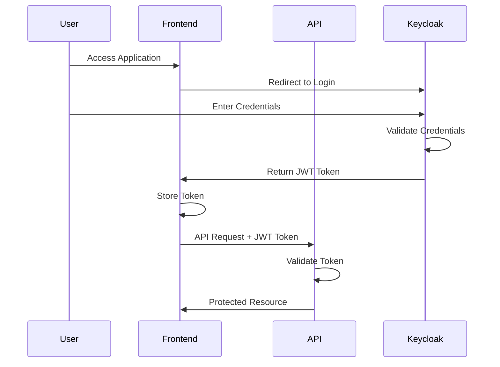
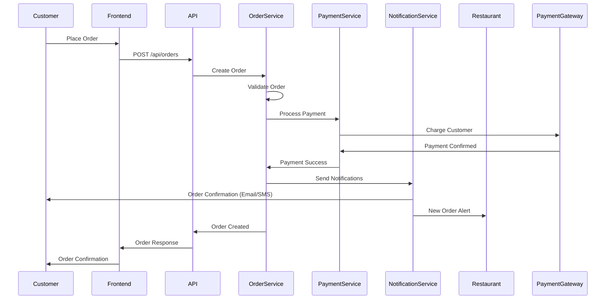
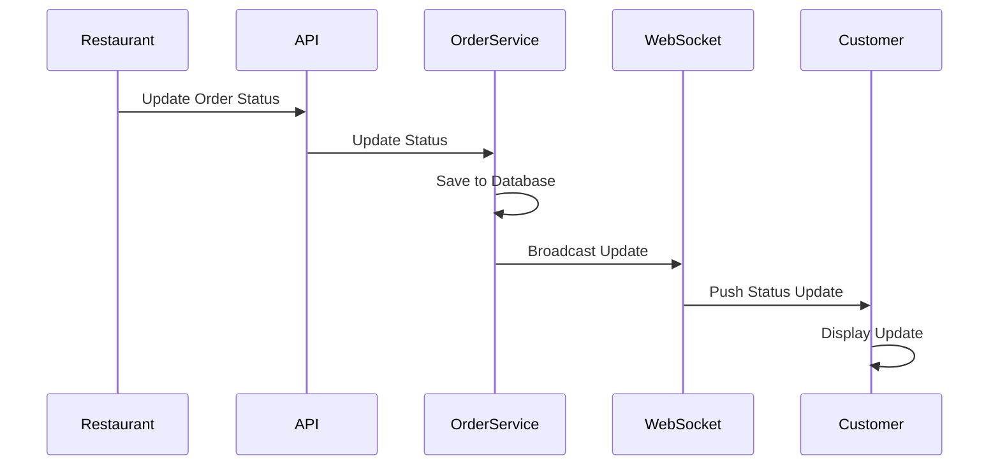
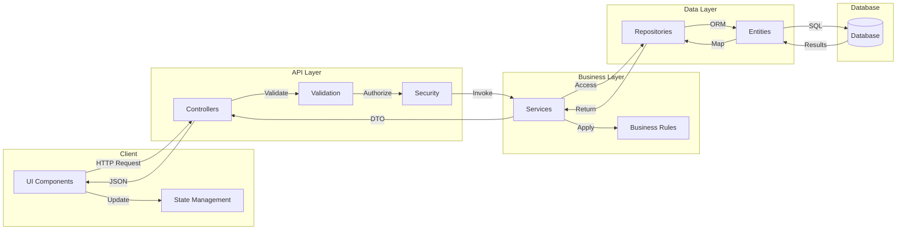
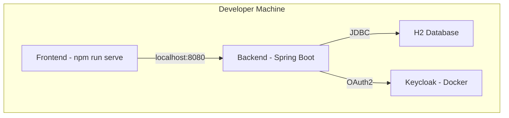
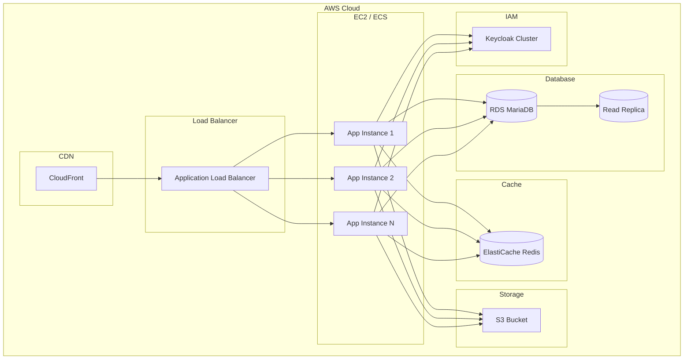
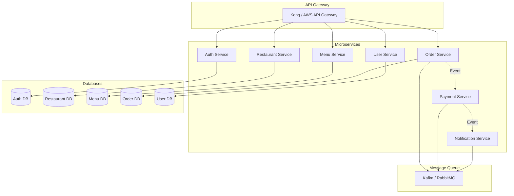

# System Architecture

## Overview

The Food Delivery Platform follows a layered, API-first architecture designed to support scalability, maintainability, and future microservices migration.

## High-Level Architecture

```mermaid
graph TB
    subgraph "Client Layer"
        WEB[Web Browser]
        MOBILE[Mobile App - Future]
    end
    
    subgraph "CDN / Load Balancer"
        CDN[CDN / CloudFront]
        LB[Load Balancer]
    end
    
    subgraph "Presentation Layer"
        ANGULAR[Angular UI]
        VUE[Vue.js UI - Recommended]
    end
    
    subgraph "API Gateway - Future"
        GATEWAY[API Gateway / Kong]
    end
    
    subgraph "Application Layer"
        subgraph "Spring Boot Application"
            REST_API[REST Controllers]
            WS[WebSocket Controller]
            SECURITY[Security Layer - OAuth2]
            
            subgraph "Business Logic"
                REST_SVC[Restaurant Service]
                MENU_SVC[Menu Service]
                ORDER_SVC[Order Service]
                CUST_SVC[Customer Service]
                PAYMENT_SVC[Payment Service]
                NOTIF_SVC[Notification Service]
            end
            
            subgraph "Data Access Layer"
                REPO[JPA Repositories]
                LIQUIBASE[Liquibase Migration]
            end
        end
    end
    
    subgraph "Data Layer"
        DB[(MariaDB / H2)]
        CACHE[(Redis Cache - Future)]
    end
    
    subgraph "External Services"
        KEYCLOAK[Keycloak IAM]
        PAYMENT_GW[Payment Gateway]
        EMAIL[Email Service]
        SMS[SMS Service]
        MAPS[Maps API]
    end
    
    subgraph "Infrastructure"
        LOGS[Logging / ELK]
        MONITOR[Monitoring]
        BACKUP[Backup Service]
    end
    
    WEB --> CDN
    MOBILE --> LB
    CDN --> ANGULAR
    CDN --> VUE
    LB --> GATEWAY
    
    ANGULAR --> REST_API
    VUE --> REST_API
    ANGULAR --> WS
    VUE --> WS
    
    GATEWAY -.Future.-> REST_API
    
    REST_API --> SECURITY
    WS --> SECURITY
    SECURITY --> KEYCLOAK
    
    REST_API --> REST_SVC
    REST_API --> MENU_SVC
    REST_API --> ORDER_SVC
    REST_API --> CUST_SVC
    
    REST_SVC --> REPO
    MENU_SVC --> REPO
    ORDER_SVC --> REPO
    CUST_SVC --> REPO
    PAYMENT_SVC --> PAYMENT_GW
    NOTIF_SVC --> EMAIL
    NOTIF_SVC --> SMS
    
    REPO --> DB
    LIQUIBASE --> DB
    REPO -.Future.-> CACHE
    
    REST_SVC --> MAPS
    ORDER_SVC --> NOTIF_SVC
    ORDER_SVC --> PAYMENT_SVC
    
    REST_API --> LOGS
    REST_API --> MONITOR
    DB --> BACKUP
    
    style VUE fill:#42b883
    style ANGULAR fill:#dd0031
    style KEYCLOAK fill:#4d4d4d
    style DB fill:#003545
```

## Architecture Layers

### 1. Client Layer

#### Web Browser
- Primary interface for all user types
- Responsive design for mobile and desktop
- Progressive Web App (PWA) capabilities

#### Mobile App (Future)
- Native iOS and Android applications
- Shares the same REST API as web clients
- Push notification support

### 2. Content Delivery & Load Balancing

#### CDN (Content Delivery Network)
- Serves static assets (JS, CSS, images)
- Reduces latency for global users
- Caching for frontend bundles

#### Load Balancer
- Distributes traffic across multiple backend instances
- Health checks and auto-scaling
- SSL/TLS termination

### 3. Presentation Layer

#### Vue.js UI (Recommended)
- **Location**: `/ui-vue`
- Modern, reactive UI framework
- Component-based architecture
- PrimeVue component library
- Vuex for state management
- Vue Router for navigation

#### Angular UI (Legacy)
- **Location**: `/ui`
- Current implementation
- Angular Material components
- Maintained for backward compatibility

**Decision**: Continue development with Vue.js for better performance and developer experience

### 4. API Gateway (Future Enhancement)

- Centralized entry point for all API requests
- Request routing and composition
- Rate limiting and throttling
- API versioning
- Request/response transformation
- Authentication delegation

### 5. Application Layer (Spring Boot)

#### REST Controllers
- RESTful API endpoints
- JSON request/response
- OpenAPI/Swagger documentation
- Input validation
- Exception handling

#### WebSocket Controller
- Real-time bidirectional communication
- Order status updates
- Live notifications
- Restaurant availability updates

#### Security Layer
- OAuth2 Resource Server
- JWT token validation
- Role-based access control (RBAC)
- Integration with Keycloak
- CSRF protection
- CORS configuration

#### Business Logic Layer

**Services Pattern**:
- Encapsulates business logic
- Transaction management
- Business rule validation
- Service-to-service communication

**Key Services**:
- **Restaurant Service**: Restaurant CRUD, search, configuration
- **Menu Service**: Menu and menu item management
- **Order Service**: Order processing, status management
- **Customer Service**: User management, profiles
- **Payment Service**: Payment processing integration
- **Notification Service**: Email, SMS, push notifications

#### Data Access Layer
- **Spring Data JPA**: Object-relational mapping
- **Repository Pattern**: Data access abstraction
- **Liquibase**: Database version control and migration
- **Entity Classes**: Domain model
- **Custom Queries**: Complex query support

### 6. Data Layer

#### MariaDB (Production)
- Primary relational database
- ACID compliance
- Master-slave replication (future)
- Automated backups

#### H2 (Development/Testing)
- In-memory database
- Fast test execution
- Development environment

#### Redis Cache (Future)
- Session management
- Frequently accessed data caching
- Real-time features support
- Rate limiting counters

### 7. External Services

#### Keycloak (IAM)
- Identity and Access Management
- User authentication
- Single Sign-On (SSO)
- User federation
- OAuth2/OIDC provider

#### Payment Gateway
- Stripe / PayPal integration
- PCI DSS compliance
- Tokenized payments
- Webhook handling

#### Email Service
- SendGrid / AWS SES
- Transactional emails
- Order confirmations
- Marketing emails

#### SMS Service
- Twilio
- Order status notifications
- OTP verification

#### Maps API
- Google Maps
- Restaurant location
- Delivery address validation
- Distance calculation
- Geocoding

### 8. Infrastructure Layer

#### Logging
- SLF4J + Logback
- Structured logging
- ELK Stack (future): Elasticsearch, Logstash, Kibana
- Centralized log aggregation

#### Monitoring
- Spring Boot Actuator
- Health checks
- Metrics collection
- Application Insights / Prometheus (future)

#### Backup Service
- Automated database backups
- Point-in-time recovery
- Disaster recovery plan

## Component Interaction Flows

### User Authentication Flow

### Order Placement Flow

### Real-time Order Status Update

## Data Flow Architecture

## Deployment Architecture

### Current (Development)

### Recommended (Production)

## Security Architecture

```mermaid
graph TB
    subgraph "Security Layers"
        subgraph "Network Security"
            FW[Firewall]
            WAF[Web Application Firewall]
        end
        
        subgraph "Application Security"
            TLS[TLS/HTTPS]
            AUTH[Authentication]
            AUTHZ[Authorization]
            VALID[Input Validation]
        end
        
        subgraph "Data Security"
            ENC[Encryption at Rest]
            TRANS[Encryption in Transit]
            MASK[Data Masking]
        end
        
        subgraph "Compliance"
            PCI[PCI DSS]
            GDPR[GDPR]
            AUDIT[Audit Logs]
        end
    end
    
    FW --> WAF
    WAF --> TLS
    TLS --> AUTH
    AUTH --> AUTHZ
    AUTHZ --> VALID
    
    VALID --> ENC
    ENC --> TRANS
    TRANS --> MASK
    
    MASK --> PCI
    PCI --> GDPR
    GDPR --> AUDIT
```

## Scalability Strategy

### Horizontal Scaling
- Multiple application instances behind load balancer
- Stateless application design
- Session storage in Redis
- Database connection pooling

### Vertical Scaling
- Increase instance size for database
- Optimize queries and indexes
- Connection pool tuning

### Caching Strategy
- Redis for session management
- Application-level caching
- HTTP caching headers
- CDN for static content

### Database Optimization
- Read replicas for read-heavy operations
- Query optimization
- Index optimization
- Partitioning for large tables (future)

## Future Microservices Architecture

## Design Principles

### 1. Separation of Concerns
- Clear layer boundaries
- Single responsibility principle
- Loose coupling

### 2. API-First Design
- Well-defined REST API
- OpenAPI documentation
- Versioning strategy

### 3. Stateless Application
- No server-side sessions
- JWT-based authentication
- Scalable horizontally

### 4. Security by Design
- Defense in depth
- Principle of least privilege
- Secure by default

### 5. Observability
- Comprehensive logging
- Metrics and monitoring
- Distributed tracing (future)

### 6. Resilience
- Graceful degradation
- Circuit breakers (future)
- Retry mechanisms
- Timeout handling

## Technology Stack Summary

| Layer | Technology | Purpose |
|-------|-----------|---------|
| Frontend | Vue.js 3 | UI Framework |
| UI Components | PrimeVue | Component Library |
| Backend | Spring Boot 2.4 | Application Framework |
| Database | MariaDB | Primary Data Store |
| Cache | Redis (Future) | Performance |
| Authentication | Keycloak | IAM |
| API Docs | Swagger/OpenAPI | Documentation |
| Build (BE) | Maven | Dependency Management |
| Build (FE) | npm / Vue CLI | Frontend Build |
| ORM | Spring Data JPA | Data Access |
| Migration | Liquibase | Schema Management |

## Conclusion

This architecture provides:
- **Scalability**: Can grow from MVP to enterprise scale
- **Maintainability**: Clear separation of concerns
- **Flexibility**: Easy to add new features
- **Security**: Multiple layers of protection
- **Performance**: Optimized data access and caching
- **Future-proof**: Ready for microservices migration

The architecture balances current needs (monolithic simplicity) with future requirements (microservices scalability).
