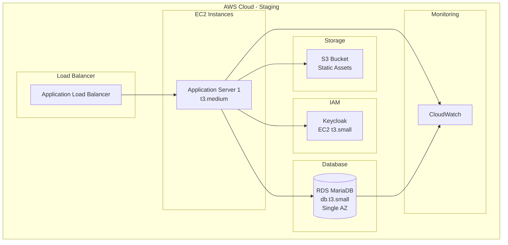
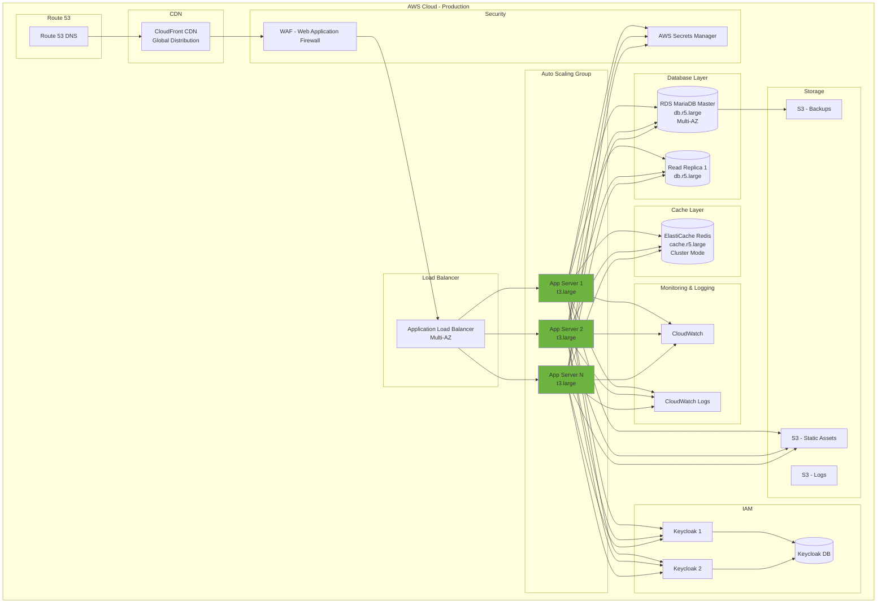
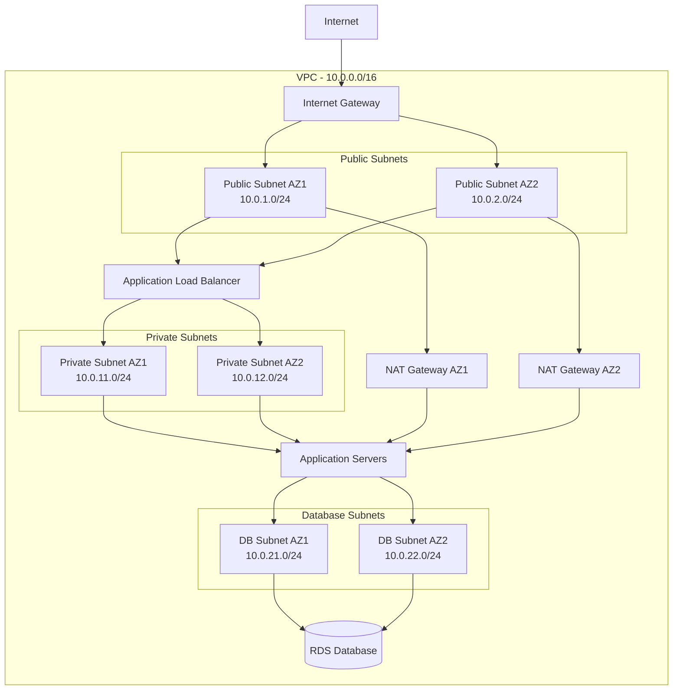
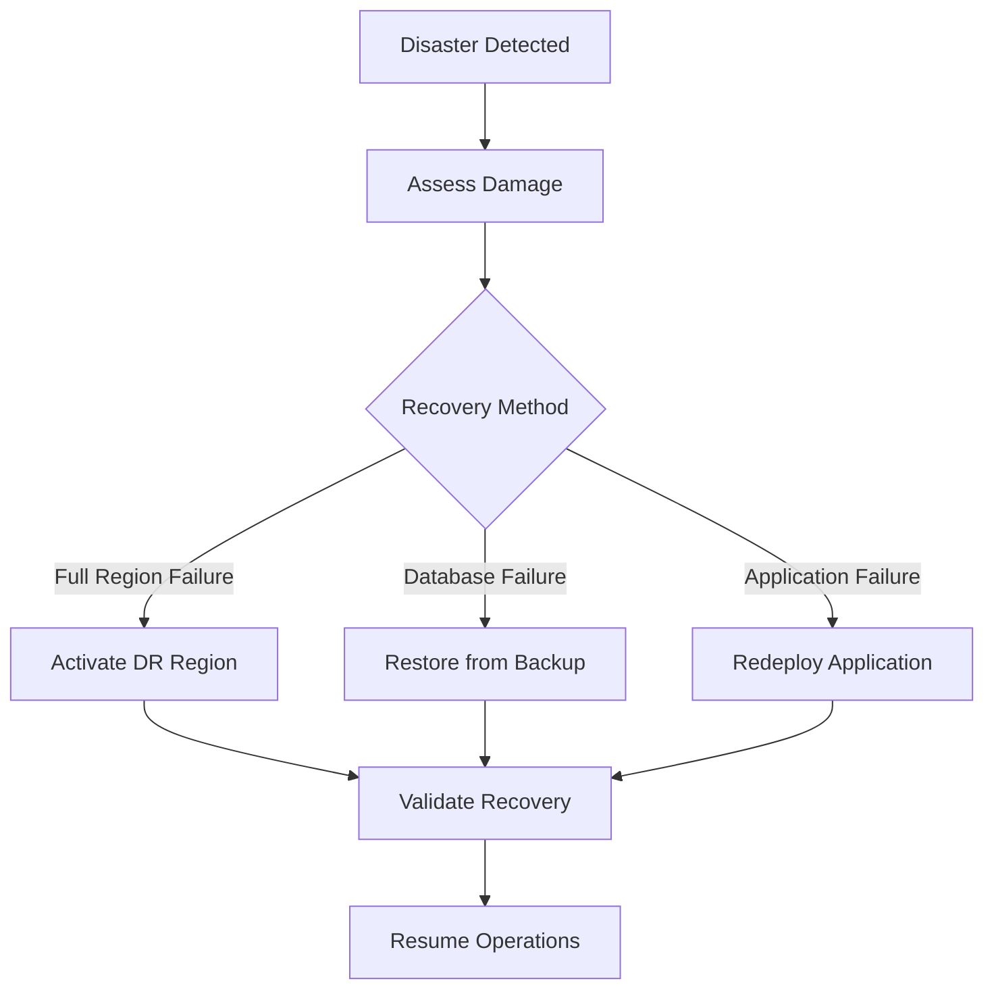

# Deployment Architecture

## Overview

This document outlines the deployment strategy and infrastructure architecture for the Food Delivery Platform across different environments.

## Environment Strategy

### 1. Development Environment

**Purpose**: Individual developer workstations for feature development

**Components**:

```mermaid
graph TB
    subgraph "Developer Machine"
        IDE[IDE - IntelliJ / VS Code]
        FE[Frontend - npm run serve<br/>Port 8081]
        BE[Spring Boot<br/>Port 8080]
        DB[H2 Database<br/>In-Memory]
        KC[Keycloak<br/>Docker Container<br/>Port 8090]
    end
    
    subgraph "External"
        GIT[GitHub Repository]
    end
    
    IDE -->|Edit Code| FE
    IDE -->|Edit Code| BE
    FE -->|API Calls| BE
    BE -->|JDBC| DB
    BE -->|OAuth2| KC
    IDE -->|Commit| GIT
    
    style FE fill:#42b883
    style BE fill:#6DB33F
    style DB fill:#003545
    style KC fill:#4d4d4d
```


**Configuration**:
- **Frontend**: Vue.js dev server on port 8081
- **Backend**: Spring Boot embedded Tomcat on port 8080
- **Database**: H2 in-memory for rapid development
- **IAM**: Keycloak in Docker container
- **Storage**: Local filesystem

**Setup**:
```bash
# Backend
cd api
mvn spring-boot:run

# Frontend
cd ui-vue
npm install
npm run serve

# Keycloak
docker run -p 8090:8080 \
  -e KEYCLOAK_USER=admin \
  -e KEYCLOAK_PASSWORD=admin \
  quay.io/keycloak/keycloak:latest
```

### 2. Staging Environment

**Purpose**: Pre-production testing and QA



**Configuration**:
- **Compute**: 1x EC2 t3.medium instance
- **Database**: RDS MariaDB db.t3.small (Single AZ)
- **Load Balancer**: Application Load Balancer
- **Storage**: S3 for static assets
- **IAM**: Dedicated Keycloak instance
- **Monitoring**: CloudWatch for logs and metrics

### 3. Production Environment

**Purpose**: Live customer-facing environment



**Configuration**:
- **Compute**: Auto Scaling Group (2-10 instances, t3.large)
- **Database**: 
  - RDS MariaDB db.r5.large (Multi-AZ)
  - Read Replica for read-heavy queries
- **Cache**: ElastiCache Redis cluster
- **CDN**: CloudFront for global content delivery
- **Load Balancer**: Application Load Balancer (Multi-AZ)
- **Storage**: 
  - S3 for static assets
  - S3 for backups (with versioning)
  - S3 for log archive
- **IAM**: Keycloak cluster (2+ instances) with dedicated database
- **Security**: WAF, Secrets Manager
- **Monitoring**: CloudWatch, CloudWatch Logs

## Infrastructure Components

### Compute Resources

#### EC2 Instance Sizing

| Environment | Instance Type | vCPU | Memory | Use Case |
|-------------|---------------|------|--------|----------|
| Development | N/A (Local) | - | - | Developer machine |
| Staging | t3.medium | 2 | 4 GB | QA testing |
| Production | t3.large | 2 | 8 GB | Standard traffic |
| Production (Peak) | t3.xlarge | 4 | 16 GB | Auto-scale for peaks |

#### Auto Scaling Configuration (Production)

```yaml
AutoScaling:
  MinSize: 2
  MaxSize: 10
  DesiredCapacity: 2
  TargetCPU: 70%
  TargetMemory: 80%
  ScaleUp:
    Threshold: 75% CPU for 5 minutes
    Cooldown: 300 seconds
  ScaleDown:
    Threshold: 30% CPU for 15 minutes
    Cooldown: 600 seconds
```

### Database Configuration

#### Development
```yaml
Database:
  Type: H2
  Mode: In-Memory
  URL: jdbc:h2:mem:testdb
  Username: sa
  Password: ""
```

#### Staging
```yaml
Database:
  Type: RDS MariaDB
  Version: 10.6
  Instance: db.t3.small
  Storage: 100 GB (General Purpose SSD)
  MultiAZ: false
  Backup:
    RetentionDays: 7
    Window: "03:00-04:00"
  Maintenance:
    Window: "Sun:04:00-Sun:05:00"
```

#### Production
```yaml
Database:
  Primary:
    Type: RDS MariaDB
    Version: 10.6
    Instance: db.r5.large
    Storage: 500 GB (Provisioned IOPS SSD)
    IOPS: 3000
    MultiAZ: true
    Encryption: true (KMS)
    Backup:
      RetentionDays: 30
      Window: "03:00-04:00"
    Maintenance:
      Window: "Sun:04:00-Sun:05:00"
  ReadReplica:
    Count: 1
    Instance: db.r5.large
    AutomaticBackup: false
```

### Cache Configuration (Production)

```yaml
ElastiCache:
  Engine: Redis
  Version: 7.0
  NodeType: cache.r5.large
  ClusterMode: Enabled
  Shards: 2
  ReplicasPerShard: 1
  AutomaticFailover: true
  Encryption:
    AtRest: true
    InTransit: true
  Backup:
    RetentionDays: 7
    Window: "04:00-05:00"
```

### Load Balancer Configuration

```yaml
ApplicationLoadBalancer:
  Type: Application
  Scheme: internet-facing
  SecurityGroups:
    - allow-https-from-internet
  Subnets:
    - subnet-public-az1
    - subnet-public-az2
  Listeners:
    HTTPS:
      Port: 443
      Certificate: ACM Certificate ARN
      Protocol: HTTPS
      DefaultAction: forward-to-target-group
    HTTP:
      Port: 80
      Protocol: HTTP
      DefaultAction: redirect-to-https
  HealthCheck:
    Path: /actuator/health
    Protocol: HTTP
    Port: 8080
    Interval: 30
    Timeout: 5
    HealthyThreshold: 2
    UnhealthyThreshold: 3
```

### CDN Configuration (Production)

```yaml
CloudFront:
  Origins:
    - Id: S3-Static-Assets
      Domain: static.spydermama.com.s3.amazonaws.com
      OriginPath: /
    - Id: ALB-API
      Domain: api.spydermama.com
      Protocol: https-only
  Behaviors:
    Static:
      PathPattern: /static/*
      Origin: S3-Static-Assets
      Compress: true
      CacheTTL: 86400
    API:
      PathPattern: /api/*
      Origin: ALB-API
      CacheTTL: 0
      ForwardHeaders:
        - Authorization
        - Accept
  CertificateARN: ACM Certificate ARN
  PriceClass: PriceClass_All
  GeoRestriction: none
```

## Security Architecture

### Network Security



### Security Groups

#### Load Balancer Security Group
```yaml
SecurityGroup: sg-alb
  InboundRules:
    - Port: 443
      Protocol: TCP
      Source: 0.0.0.0/0
      Description: HTTPS from internet
    - Port: 80
      Protocol: TCP
      Source: 0.0.0.0/0
      Description: HTTP from internet
  OutboundRules:
    - Port: 8080
      Protocol: TCP
      Destination: sg-application
      Description: To application servers
```

#### Application Security Group
```yaml
SecurityGroup: sg-application
  InboundRules:
    - Port: 8080
      Protocol: TCP
      Source: sg-alb
      Description: From load balancer
  OutboundRules:
    - Port: 3306
      Protocol: TCP
      Destination: sg-database
      Description: To database
    - Port: 6379
      Protocol: TCP
      Destination: sg-redis
      Description: To Redis
    - Port: 443
      Protocol: TCP
      Destination: 0.0.0.0/0
      Description: External APIs (HTTPS)
```

#### Database Security Group
```yaml
SecurityGroup: sg-database
  InboundRules:
    - Port: 3306
      Protocol: TCP
      Source: sg-application
      Description: From application servers
  OutboundRules: []
```

### Secrets Management

```yaml
SecretsManager:
  Secrets:
    - Name: /prod/db/credentials
      Keys:
        - username
        - password
        - host
        - port
    - Name: /prod/keycloak/credentials
      Keys:
        - admin-username
        - admin-password
    - Name: /prod/payment/stripe-api-key
      Keys:
        - secret-key
        - publishable-key
    - Name: /prod/jwt/signing-key
      Keys:
        - private-key
        - public-key
  Rotation:
    Enabled: true
    Schedule: 90 days
```

## CI/CD Pipeline

```mermaid
graph LR
    subgraph "GitHub"
        CODE[Source Code]
        PR[Pull Request]
    end
    
    subgraph "GitHub Actions"
        BUILD[Build & Test]
        SCAN[Security Scan]
        DOCKER[Build Docker Image]
    end
    
    subgraph "Container Registry"
        ECR[Amazon ECR]
    end
    
    subgraph "Deployment"
        STAGING[Deploy to Staging]
        APPROVAL[Manual Approval]
        PROD[Deploy to Production]
    end
    
    CODE --> PR
    PR --> BUILD
    BUILD --> SCAN
    SCAN --> DOCKER
    DOCKER --> ECR
    ECR --> STAGING
    STAGING --> APPROVAL
    APPROVAL --> PROD
    
    style APPROVAL fill:#ff9800
```



### Build Pipeline

```yaml
# .github/workflows/build.yml
name: Build and Deploy

on:
  push:
    branches: [main]
  pull_request:
    branches: [main]

jobs:
  build-backend:
    runs-on: ubuntu-latest
    steps:
      - uses: actions/checkout@v2
      
      - name: Set up JDK 11
        uses: actions/setup-java@v2
        with:
          java-version: '11'
          
      - name: Build with Maven
        run: cd api && mvn clean package
        
      - name: Run tests
        run: cd api && mvn test
        
      - name: Upload artifact
        uses: actions/upload-artifact@v2
        with:
          name: api-jar
          path: api/target/*.jar
  
  build-frontend:
    runs-on: ubuntu-latest
    steps:
      - uses: actions/checkout@v2
      
      - name: Set up Node.js
        uses: actions/setup-node@v2
        with:
          node-version: '14'
          
      - name: Install dependencies
        run: cd ui-vue && npm install
        
      - name: Build
        run: cd ui-vue && npm run build
        
      - name: Upload artifact
        uses: actions/upload-artifact@v2
        with:
          name: frontend-dist
          path: ui-vue/dist/
  
  deploy-staging:
    needs: [build-backend, build-frontend]
    runs-on: ubuntu-latest
    if: github.ref == 'refs/heads/main'
    steps:
      - name: Deploy to Staging
        # Deployment steps
        
  deploy-production:
    needs: deploy-staging
    runs-on: ubuntu-latest
    environment: production
    if: github.ref == 'refs/heads/main'
    steps:
      - name: Deploy to Production
        # Deployment steps with manual approval
```

## Monitoring and Logging

### Application Monitoring

```yaml
CloudWatch:
  Metrics:
    Application:
      - CPUUtilization
      - MemoryUtilization
      - RequestCount
      - ResponseTime
      - ErrorRate
    Database:
      - CPUUtilization
      - DatabaseConnections
      - ReadIOPS
      - WriteIOPS
      - FreeStorageSpace
    Cache:
      - CPUUtilization
      - CacheHits
      - CacheMisses
      - EvictionCount
  Alarms:
    HighCPU:
      Metric: CPUUtilization
      Threshold: 80%
      Duration: 5 minutes
      Action: SNS notification + Auto-scale
    HighErrorRate:
      Metric: ErrorRate
      Threshold: 5%
      Duration: 5 minutes
      Action: SNS notification
    DatabaseConnections:
      Metric: DatabaseConnections
      Threshold: 80% of max
      Duration: 5 minutes
      Action: SNS notification
```

### Logging Strategy

```yaml
Logging:
  Application:
    Level: INFO
    Format: JSON
    Destination: CloudWatch Logs
    RetentionDays: 30
    Categories:
      - access-logs
      - application-logs
      - error-logs
      - audit-logs
  
  LoadBalancer:
    Enabled: true
    Destination: S3
    Format: ELB Access Log Format
    
  Database:
    SlowQueryLog: true
    SlowQueryThreshold: 2 seconds
    ErrorLog: true
    GeneralLog: false
```

## Backup and Disaster Recovery

### Backup Strategy

```yaml
Backups:
  Database:
    Automated:
      Frequency: Daily
      RetentionDays: 30
      Window: "03:00-04:00 UTC"
    Manual:
      RetentionDays: 90
  
  Application:
    CodeRepository: GitHub (unlimited history)
    Configuration: AWS Systems Manager Parameter Store
    
  StaticAssets:
    S3Versioning: Enabled
    RetentionDays: 90
```

### Disaster Recovery Plan

**Recovery Time Objective (RTO)**: 4 hours  
**Recovery Point Objective (RPO)**: 1 hour



## Cost Optimization

### Estimated Monthly Costs (Production)

| Component | Configuration | Monthly Cost (USD) |
|-----------|---------------|-------------------|
| EC2 Instances (2x t3.large) | On-Demand, 24/7 | $122 |
| RDS MariaDB (db.r5.large) | Multi-AZ | $465 |
| RDS Read Replica | db.r5.large | $232 |
| ElastiCache Redis | cache.r5.large, 2 nodes | $328 |
| Application Load Balancer | Standard | $22 |
| CloudFront | 1 TB transfer | $85 |
| S3 Storage | 500 GB | $12 |
| Data Transfer | 2 TB outbound | $180 |
| CloudWatch | Logs + Metrics | $30 |
| **Total** | | **~$1,476/month** |

### Cost Optimization Strategies

1. **Reserved Instances**: Save 30-40% on EC2 and RDS with 1-year commitment
2. **S3 Lifecycle Policies**: Move old data to Glacier for archival
3. **Auto Scaling**: Scale down during off-peak hours
4. **Spot Instances**: Use for non-critical workloads
5. **CloudFront Caching**: Reduce origin requests
6. **Database Query Optimization**: Reduce IOPS and compute costs

## Deployment Checklist

### Pre-Deployment

- [ ] Code review completed
- [ ] All tests passing
- [ ] Security scan completed
- [ ] Database migrations tested
- [ ] Backup verified
- [ ] Rollback plan prepared
- [ ] Monitoring alerts configured
- [ ] Documentation updated

### Deployment Steps

1. **Database Migration** (if needed)
   ```bash
   liquibase update
   ```

2. **Deploy Application**
   ```bash
   # Blue-Green deployment
   # 1. Deploy to new instances
   # 2. Run health checks
   # 3. Switch load balancer target
   # 4. Monitor for issues
   # 5. Terminate old instances
   ```

3. **Deploy Frontend**
   ```bash
   aws s3 sync ./dist s3://static-bucket/ --delete
   aws cloudfront create-invalidation --distribution-id XXX --paths "/*"
   ```

### Post-Deployment

- [ ] Health checks passing
- [ ] No error spike in logs
- [ ] Key user flows tested
- [ ] Monitoring dashboards checked
- [ ] Rollback plan ready if needed
- [ ] Stakeholders notified

## Conclusion

This deployment architecture provides:
- **High Availability**: Multi-AZ deployment with auto-scaling
- **Security**: Multiple layers of security controls
- **Scalability**: Auto-scaling to handle traffic growth
- **Disaster Recovery**: Automated backups and recovery procedures
- **Monitoring**: Comprehensive observability
- **Cost Efficiency**: Optimized resource usage

The architecture is designed to grow from a simple staging environment to a robust, highly available production system.
