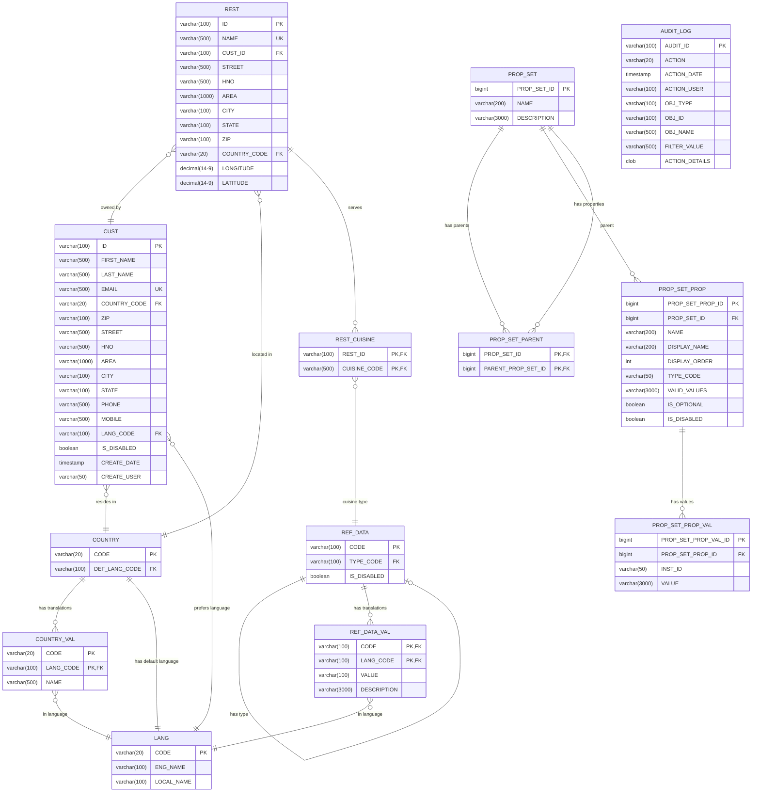

# Entity Relationship Diagram (ERD)

## Overview

This document presents the Entity Relationship Diagram for the Food Delivery Platform database schema. The schema is designed to support a multi-tenant food delivery platform similar to Lieferando/Uber Eats.

## Database Schema Diagram



## Entity Descriptions

### Core Entities

#### LANG (Language)
- Stores supported languages for the platform
- Enables multi-language support across the application
- Referenced by country, customer, and reference data translations

#### COUNTRY
- Stores country information
- Links to default language for each country
- Supports international expansion

#### COUNTRY_VAL
- Multi-language translations for country names
- Composite primary key (CODE, LANG_CODE)

### Reference Data

#### REF_DATA
- Generic reference/lookup data table
- Self-referencing for type hierarchies
- Used for cuisines, order statuses, payment methods, etc.
- Supports enablement/disablement

#### REF_DATA_VAL
- Multi-language translations for reference data
- Provides descriptions in multiple languages

### User Management

#### CUST (Customer)
- Core user entity (can be consumers, restaurant operators, or platform operators)
- Stores personal information and address
- Links to country and preferred language
- Includes audit fields (CREATE_DATE, CREATE_USER)
- Email is unique across the platform

### Restaurant Management

#### REST (Restaurant)
- Restaurant entity
- Owned by a CUST (restaurant operator)
- Contains location information including geocoordinates
- Unique restaurant name constraint
- Links to country for location

#### REST_CUISINE
- Many-to-many relationship between restaurants and cuisines
- Allows restaurants to be tagged with multiple cuisine types
- References REF_DATA for cuisine definitions

### Configuration System

#### PROP_SET (Property Set)
- Flexible configuration system
- Allows dynamic property definitions
- Can be used for restaurant settings, menu item modifiers, etc.

#### PROP_SET_PARENT
- Enables property set inheritance
- Allows hierarchical configuration

#### PROP_SET_PROP (Property Set Property)
- Defines individual properties within a property set
- Includes display information, type, validation rules
- Supports optional and required properties

#### PROP_SET_PROP_VAL (Property Set Property Value)
- Stores actual values for properties
- Links to specific instances via INST_ID
- Flexible VARCHAR storage for different value types

### Audit & Compliance

#### AUDIT_LOG
- Comprehensive audit trail
- Tracks all important actions in the system
- Stores user, timestamp, object type, and details
- Supports compliance requirements (GDPR, etc.)

## Future Entity Additions

Based on the requirements documentation, the following entities should be added:


## Design Patterns and Best Practices

### Naming Conventions
- Table names: UPPERCASE with underscores
- Primary keys: Typically ID or CODE depending on the entity
- Foreign keys: Reference column name with _ID or _CODE suffix
- Timestamps: Use TIMESTAMP type for audit trails
- Booleans: Prefix with IS_ for clarity

### Data Integrity
- Primary keys on all tables
- Foreign key constraints for referential integrity
- Unique constraints where applicable (EMAIL, NAME, etc.)
- Check constraints for valid ranges (ratings, percentages)
- NOT NULL constraints for required fields

### Internationalization (i18n)
- Separate *_VAL tables for translations
- Composite keys including LANG_CODE
- Consistent pattern across all translatable entities

### Audit Trail
- CREATE_DATE and CREATE_USER fields on main entities
- Comprehensive AUDIT_LOG table for all operations
- Indexed fields for efficient querying

### Flexibility
- PROP_SET system for dynamic configuration
- REF_DATA for extensible lookup values
- JSON/CLOB fields for flexible data storage

### Performance Considerations
- Indexes on foreign keys
- Indexes on frequently queried fields
- Composite indexes for common query patterns
- Proper data types to minimize storage

## Database Technology

### Current Implementation
- **Liquibase** for schema version control
- **MariaDB** for production
- **H2** for development/testing
- **Spring Data JPA** for data access

### Recommended Indexes (Additional)

```sql
-- Customer searches
CREATE INDEX CUST_EMAIL_IDX ON CUST(EMAIL);
CREATE INDEX CUST_PHONE_IDX ON CUST(PHONE);

-- Restaurant searches
CREATE INDEX REST_CITY_IDX ON REST(CITY);
CREATE INDEX REST_NAME_IDX ON REST(NAME);
CREATE INDEX REST_LOCATION_IDX ON REST(LATITUDE, LONGITUDE);

-- Order queries
CREATE INDEX ORDER_DATE_IDX ON CUST_ORDER(ORDER_DATE);
CREATE INDEX ORDER_STATUS_IDX ON CUST_ORDER(ORDER_STATUS_CODE);
CREATE INDEX ORDER_CUST_IDX ON CUST_ORDER(CUST_ID, ORDER_DATE);
CREATE INDEX ORDER_REST_IDX ON CUST_ORDER(REST_ID, ORDER_DATE);

-- Review queries
CREATE INDEX REVIEW_REST_IDX ON REVIEW(REST_ID, REVIEW_DATE);
CREATE INDEX REVIEW_RATING_IDX ON REVIEW(RATING);
```

## Data Model Evolution Strategy

### Version 1 (Current - MVP)
- Basic user and restaurant management
- Property set system for flexibility
- Audit logging
- Reference data framework

### Version 2 (Planned)
- Menu management
- Order processing
- Payment integration
- Reviews and ratings

### Version 3 (Future)
- Loyalty programs
- Advanced promotions
- Delivery tracking
- Restaurant analytics

## Conclusion

The ERD is designed to:
- Support multi-tenancy for restaurants
- Enable internationalization
- Provide flexibility through property sets
- Maintain data integrity through constraints
- Support audit and compliance requirements
- Scale as the platform grows

The schema follows industry best practices and is ready to support the full requirements documented in the requirements folder.
